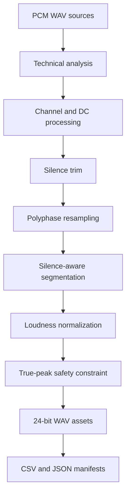

# Voice Dataset Preparation Toolkit

A local-first Python toolkit for auditing and preparing spoken-word recordings for voice cloning, speech generation, dubbing, and audio-quality workflows.

The project turns heterogeneous PCM WAV recordings into a consistent, documented dataset. It analyzes technical quality, trims non-destructive silence boundaries, converts channel layout and sample rate, creates silence-aware segments, applies loudness normalization without exceeding a true-peak ceiling, and writes machine-readable manifests.

No audio is uploaded. All processing happens locally.

## Why this project exists

Voice systems are highly sensitive to input quality. Inconsistent sample rates, channel layouts, clipping, DC offset, excessive silence, uncontrolled loudness, and undocumented processing can reduce cloning quality and make datasets difficult to reproduce.

This toolkit provides a transparent preparation pipeline with explicit measurements and traceable output. It is intended to support audio engineers, voice designers, dataset curators, and technical production teams. It does not train or clone a voice by itself.

## Features

- Recursive analysis of PCM WAV datasets
- 8-, 16-, 24-, and 32-bit integer PCM WAV decoding
- Sample rate, bit depth, channel count, duration, RMS, sample peak, and crest factor
- Four-times oversampled true-peak estimation
- ITU-R BS.1770-style K-weighting and gated integrated loudness estimation
- Clipping, DC offset, silence-ratio, short-file, and channel-layout warnings
- Optional stereo-to-mono conversion
- Optional DC-offset removal
- RMS-based leading and trailing silence trimming with configurable padding
- High-quality polyphase sample-rate conversion
- Silence-aware segmentation with minimum and maximum durations
- Loudness normalization constrained by a configurable true-peak ceiling
- Deterministic output naming
- CSV and JSON analysis reports
- CSV and JSON preparation manifests with source-to-output traceability
- TOML configuration and CLI overrides
- Atomic output writes to avoid leaving partial audio files
- Standard-library test runner and GitHub Actions CI

## Pipeline



## Installation

Python 3.11 or newer is required.

```bash
git clone https://github.com/kraczwoj/voice-dataset-preparation-toolkit.git
cd voice-dataset-preparation-toolkit
python -m venv .venv
```

Activate the environment:

```bash
# macOS / Linux
source .venv/bin/activate

# Windows PowerShell
.venv\Scripts\Activate.ps1
```

Install the package:

```bash
python -m pip install --upgrade pip
python -m pip install -e .
```

## Quick start

Analyze a directory without modifying its contents:

```bash
voiceprep analyze ./recordings --csv analysis.csv --json analysis.json
```

Prepare a dataset with the default voice-cloning profile:

```bash
voiceprep prepare ./recordings ./prepared
```

Example terminal output:

```text
[OK] recordings/session_a.wav: 3 asset(s)
[OK] recordings/session_b.wav: 2 asset(s)
Prepared 5 asset(s) from 2 source file(s).
Manifest: prepared/manifest.json
```

Use the included configuration:

```bash
voiceprep prepare ./recordings ./prepared --config examples/voice_cloning.toml
```

Override selected parameters from the command line:

```bash
voiceprep prepare ./recordings ./prepared \
  --sample-rate 24000 \
  --bit-depth 24 \
  --target-lufs -23 \
  --peak-ceiling -1 \
  --max-segment 30 \
  --prefix narrator
```

Preserve stereo and disable silence trimming:

```bash
voiceprep prepare ./recordings ./prepared --stereo --no-trim
```

Disable loudness normalization while retaining all other preparation stages:

```bash
voiceprep prepare ./recordings ./prepared --no-normalize
```

The command refuses to replace existing numbered assets using the same prefix. Pass `--overwrite` only when replacing that prepared output is intentional. Source recordings are never overwritten.

## Demo dataset

Generate deterministic synthetic voice-like files:

```bash
python scripts/generate_demo_dataset.py
voiceprep analyze demo_input
voiceprep prepare demo_input demo_output --config examples/voice_cloning.toml
```

The generated signals are for pipeline demonstration only. They are not speech and are not intended for model training.

## Output structure

```text
prepared/
├── voice_00001.wav
├── voice_00002.wav
├── voice_00003.wav
├── manifest.csv
└── manifest.json
```

Each manifest entry records:

- original source path
- output path and segment index
- source start and end time
- applied gain
- requested and achieved integrated loudness
- whether normalization was constrained by the peak ceiling
- complete post-processing quality metrics
- machine-readable warning labels

## Default preparation profile

| Parameter | Default | Rationale |
|---|---:|---|
| Sample rate | 24 kHz | Practical speech-generation delivery format |
| Bit depth | 24-bit PCM | Preserves processing headroom and avoids lossy encoding |
| Channels | Mono | Consistent voice dataset topology |
| Silence threshold | -45 dBFS | Conservative starting point for spoken-word trimming |
| Trim padding | 150 ms | Retains natural consonant and breath boundaries |
| Segment duration | 1–30 s | Useful range for manageable spoken-word assets |
| Loudness target | -23 LUFS | Conservative working level with available headroom |
| True-peak ceiling | -1 dBFS | Prevents normalization from creating excessive peaks |

These defaults are not universal requirements. Dataset specifications from the target model or platform should take priority.

## Quality metrics

### Integrated loudness

The toolkit applies a two-stage K-weighting filter and absolute/relative block gating based on ITU-R BS.1770 concepts. The implementation is designed for mono and stereo voice material. It is not a certified broadcast loudness meter.

### True peak

True peak is estimated using four-times polyphase oversampling. This is a safety-oriented estimate, not a replacement for a certified compliance meter.

### Silence

Silence statistics use 20 ms RMS frames with a 10 ms hop. Trimming retains configurable padding and never overwrites source files.

### Peak-constrained normalization

The toolkit performs gain-only loudness normalization. If the requested loudness gain would exceed the true-peak ceiling, it reduces the applied gain and records `peak_limited_normalization: true`. It does not hide the conflict with an automatic limiter or hard clipping.

## Safety and privacy

- Input files are read-only.
- Output files are written to a separate directory.
- Temporary output is atomically renamed only after a complete WAV write.
- No network calls, telemetry, model inference, or cloud upload are implemented.
- No API key is required.
- Avoid committing customer recordings, biometric voice data, or confidential datasets.
- Obtain explicit consent and verify applicable law before processing a person's voice.

## Supported audio

Version 1.0 supports uncompressed integer PCM WAV files. This deliberately keeps the decoding surface explicit and reproducible. Compressed WAV, floating-point WAV, MP3, AAC, FLAC, and video containers are rejected rather than silently converted.

For production use with other formats, convert a working copy to PCM WAV with a trusted decoder and preserve the original files separately.

## Testing

Run the complete test suite:

```bash
python -m unittest discover -s tests -v
```

The tests cover PCM round trips, 24-bit decoding, stereo topology, loudness gain tracking, clipping warnings, silence measurement, trimming, resampling, peak-constrained normalization, segmentation, and end-to-end preparation.

## Repository design

```text
src/voice_dataset_toolkit/
├── audio_io.py      # explicit integer PCM WAV codec
├── metrics.py       # loudness, peak, silence, and QC analysis
├── processing.py    # trim, resample, segment, normalize, write
├── reports.py       # CSV and JSON outputs
├── config.py        # TOML configuration
├── models.py        # typed data contracts
└── cli.py           # command-line interface
```

## Roadmap

- Optional FLAC and AIFF support through a clearly isolated decoder adapter
- Interactive review report with waveforms and flagged regions
- Speech-region detection adapter
- Pluggable dataset specifications for different voice platforms
- REAPER and Ardour import helpers
- Human-review annotation workflow

## License

MIT. See [LICENSE](LICENSE).

## Author

Wojciech Kraczewski  
Audio Engineer, Sound Designer and Audio Experience Designer  
[kraczewski.studio](https://kraczewski.studio)

For a clean first publication, see [PUBLISHING.md](PUBLISHING.md).
